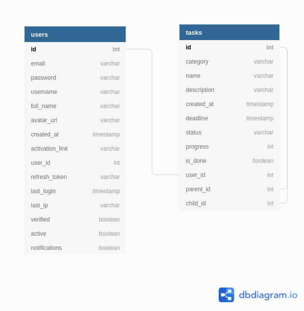

# TO-DO tool for self development
The idea of the project is to create a web application for easy organization of your time, tasks and goals.

## Functionality
#### 1. Authorization (email + password + email confirmation || Google OAuth) 
#### 2. Nesting tasks
#### 3. Division of tasks into periods: for a day, week, and overall
#### 4. Progress bar for each task group
#### 5. Task priority and status
#### 6. Auto tasks (automate task creation per day)
#### 7. Email notifications

## Technologies stack
- Node.js as a back-end server runtime
- Fastify.js as web framework
- MySQL as database
- React.js as a client-side JavaScript framework

## Database structure

## Git rules
1. One feature - one branch 
2. One change - one commit
3. All secondary branches from main branch
4. Do not work on the same files in two requests
5. Prevent merge conflicts by pulling from main branch before push 
6. Describe the committees in detail (not just "Updated" or "Changed")
7. Add reviewers to merge request

## Code style rules
1. Lint code before push
2. Use only meaningful variable name
3. Name the methods according to their purpose
4. Adhere to one level of abstraction in the method
5. One method - one action

## Development instruction
- `npm run start` - to start server
- `npm run dev` - to start the server by automatically restarting the node application when file changes in the directory are detected (with nodemon)
- `npm run test` - to start tests
- `knex migrate:make [migration name] --knexfile ./src/db/knexfile.js --env [current environment]` - to create a migration
- `nom run migrate` - to migrate latest migrations
- `npm run revert-latest` - to revert the latest migrations